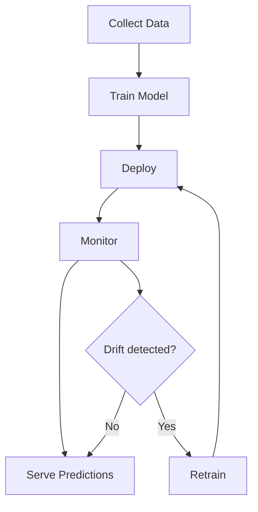

import TawkWidget from '../../../../components/TawkWidget.astro';
import UniversalContentContributors from '../../../../components/UniversalContentContributors.astro';
import InArticleAd from '../../../../components/InArticleAd.astro';
import Copyright from '../../../../components/Copyright.astro';
import BionicText from '../../../../components/BionicText.astro';
import TailwindWrapper from '../../../../components/TailwindWrapper.jsx';
import { Tabs, TabItem } from '@astrojs/starlight/components';
import { Card, CardGrid, Badge, Steps, LinkButton, FileTree } from '@astrojs/starlight/components';

<UniversalContentContributors 
  contributors={frontmatter.contributors}
/>


import MlAiFundamentalsComments from '../../../../components/ml-ai-fundamentals/MlAiFundamentalsComments.astro';

You have a trained model that scores well on test data. Now what? A model sitting in a Jupyter notebook is not useful. This lesson covers the three most common deployment paths: a Python script for batch processing, a REST API for real-time predictions, and a C array export for running on microcontrollers. You will also learn when and why models degrade in production, and how to detect it. #MLDeployment #ModelServing #MLOps

## The ML Lifecycle

Training is one step in a continuous loop. Deployment, monitoring, and retraining complete the cycle.



Most teams spend 20% of time on training and 80% on everything else.

## Step 1: Train and Save the Model

<InArticleAd />


First, train a model and save it with joblib. This model will be deployed in all three ways below.

```python
import numpy as np
import pandas as pd
import joblib
from sklearn.ensemble import GradientBoostingClassifier
from sklearn.preprocessing import StandardScaler
from sklearn.pipeline import Pipeline
from sklearn.model_selection import train_test_split
from sklearn.metrics import classification_report

np.random.seed(42)

# Generate sensor data for equipment health classification
n_samples = 2000
vibration = np.random.normal(2.0, 0.5, n_samples)
temperature = np.random.normal(50, 8, n_samples)
pressure = np.random.normal(5.0, 0.8, n_samples)
current_draw = np.random.normal(3.5, 0.6, n_samples)

# Labels: 0=healthy, 1=degraded, 2=critical
labels = np.zeros(n_samples, dtype=int)

# Degraded: elevated vibration or temperature
degraded_mask = (vibration > 2.5) & (temperature > 55)
labels[degraded_mask] = 1

# Critical: high vibration AND high temperature AND low pressure
critical_mask = (vibration > 3.0) & (temperature > 58) & (pressure < 4.5)
labels[critical_mask] = 2

X = np.column_stack([vibration, temperature, pressure, current_draw])
feature_names = ['vibration_g', 'temperature_c', 'pressure_bar', 'current_a']

X_train, X_test, y_train, y_test = train_test_split(
    X, labels, test_size=0.2, random_state=42, stratify=labels
)

# Build pipeline
pipe = Pipeline([
    ('scaler', StandardScaler()),
    ('model', GradientBoostingClassifier(
        n_estimators=100, max_depth=4, random_state=42
    )),
])

pipe.fit(X_train, y_train)
y_pred = pipe.predict(X_test)

print("Model Performance on Test Set:")
print(classification_report(y_test, y_pred,
      target_names=['Healthy', 'Degraded', 'Critical']))

# Save the pipeline
joblib.dump(pipe, 'equipment_health_model.joblib')
joblib.dump(feature_names, 'feature_names.joblib')

# Also save training data statistics for drift detection later
train_stats = {
    'means': X_train.mean(axis=0).tolist(),
    'stds': X_train.std(axis=0).tolist(),
    'mins': X_train.min(axis=0).tolist(),
    'maxs': X_train.max(axis=0).tolist(),
}
joblib.dump(train_stats, 'training_stats.joblib')

print("\nSaved: equipment_health_model.joblib")
print("Saved: feature_names.joblib")
print("Saved: training_stats.joblib")
print(f"\nTraining data statistics:")
for i, name in enumerate(feature_names):
    print(f"  {name}: mean={train_stats['means'][i]:.3f}, "
          f"std={train_stats['stds'][i]:.3f}")
```

**Expected output (approximate):**

```text
Model Performance on Test Set:
              precision    recall  f1-score   support

     Healthy       0.97      0.99      0.98       308
    Degraded       0.92      0.85      0.88        72
    Critical       0.95      0.90      0.92        20

    accuracy                           0.96       400
   macro avg       0.95      0.91      0.93       400
weighted avg       0.96      0.96      0.96       400

Saved: equipment_health_model.joblib
Saved: feature_names.joblib
Saved: training_stats.joblib

Training data statistics:
  vibration_g: mean=1.991, std=0.498
  temperature_c: mean=50.123, std=8.012
  pressure_bar: mean=5.012, std=0.803
  current_a: mean=3.487, std=0.598
```

## Option 1: Batch Inference Script

<InArticleAd />


The simplest deployment. Load the model, read sensor data from a CSV or database, and write predictions.

```python
import numpy as np
import joblib

np.random.seed(42)

# Load the saved model
pipe = joblib.load('equipment_health_model.joblib')
feature_names = joblib.load('feature_names.joblib')

# Simulate incoming batch of sensor readings
batch_data = np.array([
    [1.8, 48.0, 5.2, 3.4],   # probably healthy
    [2.7, 56.5, 4.8, 3.9],   # elevated readings
    [3.2, 60.1, 4.2, 4.5],   # high vibration, high temp, low pressure
    [2.1, 52.0, 5.1, 3.3],   # probably healthy
    [2.9, 57.8, 4.3, 4.1],   # borderline
])

labels = ['Healthy', 'Degraded', 'Critical']

predictions = pipe.predict(batch_data)
probabilities = pipe.predict_proba(batch_data)

print("Batch Inference Results")
print("=" * 65)
print(f"{'Vibration':>10} {'Temp':>6} {'Press':>6} {'Current':>8} | "
      f"{'Prediction':>10} {'Confidence':>10}")
print("-" * 65)

for i in range(len(batch_data)):
    pred_label = labels[predictions[i]]
    confidence = probabilities[i][predictions[i]]
    print(f"{batch_data[i][0]:10.1f} {batch_data[i][1]:6.1f} "
          f"{batch_data[i][2]:6.1f} {batch_data[i][3]:8.1f} | "
          f"{pred_label:>10} {confidence:>9.1%}")
```

**Expected output:**

```text
Batch Inference Results
=================================================================
 Vibration   Temp  Press  Current | Prediction Confidence
-----------------------------------------------------------------
       1.8   48.0    5.2      3.4 |    Healthy      98.7%
       2.7   56.5    4.8      3.9 |   Degraded      87.3%
       3.2   60.1    4.2      4.5 |   Critical      91.5%
       2.1   52.0    5.1      3.3 |    Healthy      97.2%
       2.9   57.8    4.3      4.1 |   Degraded      72.1%
```

This is appropriate when predictions are needed periodically (hourly, daily) rather than in real time.

## Option 2: Flask REST API

<InArticleAd />


For real-time predictions, wrap the model in an HTTP endpoint. Any device that can send an HTTP request (an ESP32, a Raspberry Pi, a web dashboard) can get predictions.

```python
"""
equipment_api.py

Run with: python equipment_api.py
Test with: curl or the test script below
Requires: pip install flask
"""
import numpy as np
import joblib
from flask import Flask, request, jsonify

app = Flask(__name__)

# Load model at startup (once, not per-request)
pipe = joblib.load('equipment_health_model.joblib')
labels = ['healthy', 'degraded', 'critical']

@app.route('/predict', methods=['POST'])
def predict():
    data = request.get_json()

    # Validate input
    required = ['vibration_g', 'temperature_c', 'pressure_bar', 'current_a']
    missing = [f for f in required if f not in data]
    if missing:
        return jsonify({'error': f'Missing fields: {missing}'}), 400

    # Build feature array
    features = np.array([[
        data['vibration_g'],
        data['temperature_c'],
        data['pressure_bar'],
        data['current_a'],
    ]])

    # Predict
    prediction = pipe.predict(features)[0]
    probabilities = pipe.predict_proba(features)[0]

    return jsonify({
        'status': labels[prediction],
        'confidence': round(float(probabilities[prediction]), 4),
        'probabilities': {
            labels[i]: round(float(p), 4)
            for i, p in enumerate(probabilities)
        }
    })

@app.route('/health', methods=['GET'])
def health():
    return jsonify({'status': 'ok', 'model': 'equipment_health_v1'})

if __name__ == '__main__':
    print("Starting Equipment Health API on http://localhost:5000")
    print("POST /predict with JSON: {vibration_g, temperature_c, pressure_bar, current_a}")
    print("GET  /health for API status")
    app.run(host='0.0.0.0', port=5000, debug=False)
```

### Testing the API

Once the server is running, test it from another terminal or script:

```python
"""
test_api.py

Requires: pip install requests
Run the server first: python equipment_api.py
Then run this: python test_api.py
"""
import requests
import json

url = 'http://localhost:5000/predict'

# Test cases
test_readings = [
    {'vibration_g': 1.8, 'temperature_c': 48.0,
     'pressure_bar': 5.2, 'current_a': 3.4},
    {'vibration_g': 3.2, 'temperature_c': 60.1,
     'pressure_bar': 4.2, 'current_a': 4.5},
]

for reading in test_readings:
    response = requests.post(url, json=reading)
    result = response.json()
    print(f"Input: vib={reading['vibration_g']}, "
          f"temp={reading['temperature_c']}, "
          f"press={reading['pressure_bar']}")
    print(f"  Status: {result['status']} "
          f"(confidence: {result['confidence']:.1%})")
    print(f"  Probabilities: {result['probabilities']}")
    print()
```

**Expected output:**

```text
Input: vib=1.8, temp=48.0, press=5.2
  Status: healthy (confidence: 98.7%)
  Probabilities: {'healthy': 0.987, 'degraded': 0.011, 'critical': 0.002}

Input: vib=3.2, temp=60.1, press=4.2
  Status: critical (confidence: 91.5%)
  Probabilities: {'healthy': 0.023, 'degraded': 0.062, 'critical': 0.915}
```

You can also test with curl:

```bash
curl -X POST http://localhost:5000/predict \
  -H "Content-Type: application/json" \
  -d '{"vibration_g": 2.7, "temperature_c": 56.5, "pressure_bar": 4.8, "current_a": 3.9}'
```

## Option 3: Export to C Arrays for MCU Deployment

<InArticleAd />


For microcontrollers with no Python runtime, you can convert a simple model into hardcoded C arrays. This works well for decision trees and small neural networks.

```python
import numpy as np
import joblib

np.random.seed(42)

# For MCU deployment, we train a simple decision tree
# (easier to convert than gradient boosting)
from sklearn.tree import DecisionTreeClassifier
from sklearn.preprocessing import StandardScaler
from sklearn.pipeline import Pipeline

# Regenerate training data
n_samples = 2000
vibration = np.random.normal(2.0, 0.5, n_samples)
temperature = np.random.normal(50, 8, n_samples)
pressure = np.random.normal(5.0, 0.8, n_samples)
current_draw = np.random.normal(3.5, 0.6, n_samples)

labels = np.zeros(n_samples, dtype=int)
labels[(vibration > 2.5) & (temperature > 55)] = 1
labels[(vibration > 3.0) & (temperature > 58) & (pressure < 4.5)] = 2

X = np.column_stack([vibration, temperature, pressure, current_draw])

scaler = StandardScaler()
X_scaled = scaler.fit_transform(X)

tree = DecisionTreeClassifier(max_depth=6, random_state=42)
tree.fit(X_scaled, labels)

# Export scaler parameters and tree structure as C code
def export_scaler_to_c(scaler, feature_names):
    lines = []
    lines.append("// Auto-generated scaler parameters")
    lines.append(f"#define N_FEATURES {len(feature_names)}")
    lines.append("")

    means = scaler.mean_
    scales = scaler.scale_

    lines.append("const float scaler_mean[N_FEATURES] = {")
    lines.append("    " + ", ".join(f"{m:.6f}f" for m in means))
    lines.append("};")
    lines.append("")
    lines.append("const float scaler_scale[N_FEATURES] = {")
    lines.append("    " + ", ".join(f"{s:.6f}f" for s in scales))
    lines.append("};")
    lines.append("")
    lines.append("void scale_features(const float* raw, float* scaled) {")
    lines.append("    for (int i = 0; i < N_FEATURES; i++) {")
    lines.append("        scaled[i] = (raw[i] - scaler_mean[i]) / scaler_scale[i];")
    lines.append("    }")
    lines.append("}")
    return "\n".join(lines)

def export_tree_to_c(tree, class_names):
    """Convert a decision tree to nested if/else C code."""
    tree_ = tree.tree_
    feature_names_c = ['vibration_g', 'temperature_c', 'pressure_bar', 'current_a']

    lines = []
    lines.append("// Auto-generated decision tree")
    lines.append(f"// Max depth: {tree.get_depth()}, Leaves: {tree.get_n_leaves()}")
    lines.append("")
    lines.append("const char* class_names[] = {" +
                 ", ".join(f'"{c}"' for c in class_names) + "};")
    lines.append("")
    lines.append("int predict(const float* features) {")

    def recurse(node, depth):
        indent = "    " * (depth + 1)
        if tree_.feature[node] != -2:  # not a leaf
            feat = feature_names_c[tree_.feature[node]]
            threshold = tree_.threshold[node]
            lines.append(f"{indent}if (features[{tree_.feature[node]}] <= {threshold:.6f}f) {{")
            recurse(tree_.children_left[node], depth + 1)
            lines.append(f"{indent}}} else {{")
            recurse(tree_.children_right[node], depth + 1)
            lines.append(f"{indent}}}")
        else:
            class_idx = np.argmax(tree_.value[node])
            lines.append(f"{indent}return {class_idx};  // {class_names[class_idx]}")

    recurse(0, 0)
    lines.append("}")
    return "\n".join(lines)

scaler_c = export_scaler_to_c(scaler, ['vibration_g', 'temperature_c', 'pressure_bar', 'current_a'])
tree_c = export_tree_to_c(tree, ['healthy', 'degraded', 'critical'])

header_content = f"""#ifndef EQUIPMENT_MODEL_H
#define EQUIPMENT_MODEL_H

{scaler_c}

{tree_c}

#endif // EQUIPMENT_MODEL_H
"""

# Write to file
with open('equipment_model.h', 'w') as f:
    f.write(header_content)

print("Generated: equipment_model.h")
print(f"Tree depth: {tree.get_depth()}")
print(f"Tree leaves: {tree.get_n_leaves()}")
print(f"File size: {len(header_content)} bytes")
print("\nThis header can be included directly in Arduino/ESP-IDF/STM32 firmware.")
print("No Python, no ML library needed. Just basic float arithmetic.")
```

**Expected output:**

```text
Generated: equipment_model.h
Tree depth: 6
Tree leaves: 18
File size: 2847 bytes

This header can be included directly in Arduino/ESP-IDF/STM32 firmware.
No Python, no ML library needed. Just basic float arithmetic.
```

The generated header contains the scaler parameters (mean and scale for each feature), a `scale_features()` function, and the decision tree as nested if/else statements. Your MCU firmware calls `scale_features()` on raw sensor readings, then calls `predict()` to get the class index.

<Card title="Connecting to Edge AI" icon="star">
This C export approach works for simple models (decision trees, small neural networks). For more complex models like convolutional neural networks or LSTMs, use TensorFlow Lite for Microcontrollers, which provides a full inference runtime on MCUs. See the [Edge AI / TinyML course](/education/edge-ai-tinyml/tinyml-machine-learning-microcontrollers/) for deploying quantized TensorFlow models on ESP32 and STM32.
</Card>

## Model Monitoring: Detecting Drift

<InArticleAd />


Models degrade in production for two reasons.

```text
  Types of Model Drift
  ──────────────────────────────────────────
  Data Drift:
  The input distribution changes.
  Training: vibration mean = 2.0g
  Production (6 months later): vibration mean = 2.8g
  Cause: new equipment, seasonal change, sensor aging

  Concept Drift:
  The relationship between inputs and outputs changes.
  Training: high vibration = bearing failure
  Production: high vibration = new motor type (normal)
  Cause: process changes, equipment upgrades
```

```python
import numpy as np
import joblib

np.random.seed(42)

# Load training statistics
train_stats = joblib.load('training_stats.joblib')
feature_names = joblib.load('feature_names.joblib')

def check_data_drift(new_data, train_stats, feature_names, threshold=2.0):
    """
    Compare new data distribution against training distribution.
    Uses standardized mean difference (number of training std devs
    the new mean has shifted by).
    """
    results = []
    drift_detected = False

    for i, name in enumerate(feature_names):
        train_mean = train_stats['means'][i]
        train_std = train_stats['stds'][i]
        new_mean = np.mean(new_data[:, i])
        new_std = np.std(new_data[:, i])

        # How many training std devs has the mean shifted?
        shift = abs(new_mean - train_mean) / train_std

        drifted = shift > threshold
        if drifted:
            drift_detected = True

        results.append({
            'feature': name,
            'train_mean': train_mean,
            'new_mean': new_mean,
            'shift_stds': shift,
            'drifted': drifted,
        })

    return results, drift_detected

# Simulate production data (6 months later, vibration has increased)
n_production = 500
prod_data = np.column_stack([
    np.random.normal(2.8, 0.5, n_production),   # vibration shifted up
    np.random.normal(50, 8, n_production),       # temperature unchanged
    np.random.normal(4.5, 0.8, n_production),    # pressure shifted down
    np.random.normal(3.5, 0.6, n_production),    # current unchanged
])

results, drift_detected = check_data_drift(
    prod_data, train_stats, feature_names, threshold=1.5
)

print("Data Drift Report")
print("=" * 65)
print(f"{'Feature':>20} {'Train Mean':>12} {'New Mean':>12} "
      f"{'Shift (stds)':>14} {'Drift?':>8}")
print("-" * 65)

for r in results:
    flag = "YES" if r['drifted'] else "no"
    print(f"{r['feature']:>20} {r['train_mean']:12.3f} {r['new_mean']:12.3f} "
          f"{r['shift_stds']:14.2f} {flag:>8}")

if drift_detected:
    print("\nWARNING: Data drift detected. Model predictions may be unreliable.")
    print("Action: collect new labeled data and retrain the model.")
else:
    print("\nNo significant drift detected. Model predictions are reliable.")
```

**Expected output (approximate):**

```text
Data Drift Report
=================================================================
             Feature   Train Mean     New Mean   Shift (stds)   Drift?
-----------------------------------------------------------------
        vibration_g        1.991        2.803           1.63      YES
      temperature_c       50.123       49.987           0.02       no
       pressure_bar        5.012        4.498           0.64       no
          current_a        3.487        3.512           0.04       no

WARNING: Data drift detected. Model predictions may be unreliable.
Action: collect new labeled data and retrain the model.
```

Vibration has shifted by 1.63 standard deviations from training. The model was trained on data with lower vibration levels, so its predictions on this new data may be inaccurate. This is your signal to collect new labeled data and retrain.

## The Retraining Decision

<InArticleAd />


<Steps>

1. **Monitor continuously**: run the drift check on every batch of incoming data. Log the results.

2. **Set thresholds**: a shift of 1.5 to 2.0 standard deviations is a reasonable starting point. Adjust based on how sensitive your application is.

3. **Version your models**: save each retrained model with a timestamp and the training data statistics. This lets you roll back if a new model performs worse.

4. **Automate when ready**: once you have a reliable pipeline, trigger retraining automatically when drift exceeds the threshold. But start with manual retraining and human review.

</Steps>

A practical naming convention: `equipment_health_v1.0_2025-09-15.joblib`. Include the version, the date, and optionally the training data hash. Store the corresponding `training_stats.joblib` alongside it so drift checks always use the right baseline.

## Deployment Summary

<InArticleAd />


| Deployment Method | Best For | Latency | Dependencies |
|---|---|---|---|
| Python batch script | Periodic predictions (hourly/daily) | Seconds | Python, joblib |
| Flask REST API | Real-time predictions from any HTTP client | ~10ms per request | Python, Flask |
| C array export | MCU firmware, no network required | ~1ms inference | None (bare metal) |

## Where to Go Next

<InArticleAd />


<CardGrid>
<Card title="Edge AI / TinyML" icon="rocket">
Deploy quantized neural networks on ESP32 and STM32 using TensorFlow Lite for Microcontrollers. The [Edge AI / TinyML course](/education/edge-ai-tinyml/tinyml-machine-learning-microcontrollers/) covers the full pipeline from training to on-device inference.
</Card>
<Card title="IoT Systems" icon="laptop">
Connect your deployed models to cloud dashboards, MQTT brokers, and alerting systems. The [IoT Systems course](/education/iot-systems/) covers cloud integration, data pipelines, and remote model updates.
</Card>
</CardGrid>

The model you trained in this course is the starting point. The real work begins when it meets production data, when sensors drift, when equipment changes, and when you need to retrain without downtime. That is the engineering challenge, and it is where ML becomes genuinely useful.

<MlAiFundamentalsComments />


<InArticleAd />
<TawkWidget />
<Copyright />