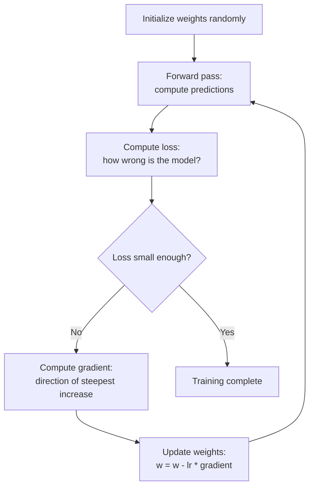

import TawkWidget from '../../../../components/TawkWidget.astro';
import UniversalContentContributors from '../../../../components/UniversalContentContributors.astro';
import InArticleAd from '../../../../components/InArticleAd.astro';
import Copyright from '../../../../components/Copyright.astro';
import BionicText from '../../../../components/BionicText.astro';
import TailwindWrapper from '../../../../components/TailwindWrapper.jsx';
import { Tabs, TabItem } from '@astrojs/starlight/components';
import { Card, CardGrid, Badge, Steps, LinkButton, FileTree } from '@astrojs/starlight/components';

<UniversalContentContributors 
  contributors={frontmatter.contributors}
/>


import MlAiFundamentalsComments from '../../../../components/ml-ai-fundamentals/MlAiFundamentalsComments.astro';

In the previous lessons, scikit-learn and np.polyfit found the best parameters for you automatically. But when something goes wrong, when the model fails to converge, when the loss plateaus, or when training takes forever, you cannot fix what you do not understand. Gradient descent is the single algorithm behind nearly all ML training: neural networks, logistic regression, SVMs, and deep learning all use it (or a variant) to find the best parameters. The idea fits in one sentence: measure how wrong the model is, compute which direction to adjust the parameters, take a small step, and repeat. This lesson implements it from scratch so you can see every number change on every iteration and diagnose problems when they arise. #GradientDescent #Optimization #MachineLearning

## The Blindfolded Hill Analogy

Imagine you are blindfolded on a hilly landscape. You want to reach the lowest valley. You cannot see, but you can feel the slope under your feet. If the ground tilts to the left, you step left. If it tilts forward, you step forward. Each step takes you a little lower. After many small steps, you arrive at the bottom (or close to it).

That is gradient descent. The landscape is the **loss function** (how wrong the model is). The slope you feel is the **gradient** (the direction of steepest increase in error). You step in the opposite direction (downhill). The size of your step is the **learning rate**.

```text
  The Loss Landscape
  ──────────────────────────────────────────────

  Loss
    |
    |  *  Start here
    |   \
    |    \    The gradient points UPHILL
    |     \   (toward increasing loss).
    |      \
    |       \  You step in the OPPOSITE
    |        \ direction (downhill).
    |         \
    |          \___
    |              \___
    |                  \___*  Minimum
    |
    +─────────────────────────────────────
              Parameter value (w)

  Update rule:
    w_new = w_old - learning_rate * gradient

  That single equation is the engine behind:
    - Linear regression
    - Logistic regression
    - Neural networks
    - Deep learning
    - Transformer models (GPT, etc.)
```



## The Loss Function: How Wrong Is the Model?

<InArticleAd />


Before you can improve a model, you need a number that tells you how wrong it is. For regression, the most common loss function is **Mean Squared Error** (MSE).

If you studied optimization or least-squares in the Applied Mathematics course, you have seen this before. The loss is the average of the squared differences between predictions and actual values:

$$
\text{MSE} = \frac{1}{n} \sum_{i=1}^{n} (y_i - \hat{y}_i)^2
$$

where $y_i$ is the actual value and $\hat{y}_i$ is the prediction.

The squaring does two things: it makes all errors positive, and it penalizes large errors more than small ones. A prediction that is off by 10 contributes 100 to the loss, while a prediction off by 1 contributes only 1.

## The Gradient: Which Way Is Downhill?

<InArticleAd />


The gradient of the loss with respect to a parameter tells you how the loss changes when you nudge that parameter. If the gradient is positive, increasing the parameter increases the loss (bad), so you should decrease the parameter. If the gradient is negative, increasing the parameter decreases the loss (good), so you should increase it.

For linear regression with a single feature ($\hat{y} = wx + b$), the gradients are:

$$
\frac{\partial \text{MSE}}{\partial w} = \frac{-2}{n} \sum_{i=1}^{n} x_i (y_i - \hat{y}_i)
$$

$$
\frac{\partial \text{MSE}}{\partial b} = \frac{-2}{n} \sum_{i=1}^{n} (y_i - \hat{y}_i)
$$

If you have taken calculus, these are just the chain rule applied to the MSE formula. If not, the key insight is: the gradient is a number that tells you the direction and magnitude of the steepest slope. You do not need to derive it from scratch every time; frameworks (and even NumPy) compute it for you.

## Gradient Descent in 25 Lines

<InArticleAd />


Here is linear regression implemented entirely with gradient descent. No scikit-learn. Just NumPy.

```python
import numpy as np

np.random.seed(42)

# ── Generate data: y = 3x + 7 + noise ──
n = 100
x = np.random.uniform(0, 10, n)
y = 3 * x + 7 + np.random.randn(n) * 2

# ── Initialize parameters randomly ──
w = np.random.randn()  # weight (slope)
b = np.random.randn()  # bias (intercept)
lr = 0.01              # learning rate
epochs = 200           # number of iterations

print(f"True parameters:    w = 3.000, b = 7.000")
print(f"Initial parameters: w = {w:.3f}, b = {b:.3f}")
print()

# ── Gradient descent loop ──
losses = []
for epoch in range(epochs):
    # Forward pass: compute predictions
    y_pred = w * x + b

    # Compute loss (MSE)
    loss = np.mean((y - y_pred) ** 2)
    losses.append(loss)

    # Compute gradients
    dw = -2 * np.mean(x * (y - y_pred))  # gradient w.r.t. weight
    db = -2 * np.mean(y - y_pred)         # gradient w.r.t. bias

    # Update parameters (step downhill)
    w = w - lr * dw
    b = b - lr * db

    # Print progress every 20 epochs
    if epoch % 20 == 0 or epoch == epochs - 1:
        print(f"Epoch {epoch:>4d}: loss = {loss:.4f}, w = {w:.4f}, b = {b:.4f}")

print(f"\nFinal parameters: w = {w:.3f}, b = {b:.3f}")
print(f"True parameters:  w = 3.000, b = 7.000")
print(f"Final loss: {losses[-1]:.4f}")
```

That is the complete algorithm. Twenty-five lines of meaningful code. Every ML model you will ever use is doing some version of this loop: predict, compute loss, compute gradient, update parameters.

## Visualizing the Learning Process

<InArticleAd />


```python
import numpy as np
import matplotlib.pyplot as plt

np.random.seed(42)

# ── Generate data ──
n = 100
x = np.random.uniform(0, 10, n)
y = 3 * x + 7 + np.random.randn(n) * 2

# ── Gradient descent with history tracking ──
w = np.random.randn()
b = np.random.randn()
lr = 0.01
epochs = 200

losses = []
w_history = [w]
b_history = [b]

for epoch in range(epochs):
    y_pred = w * x + b
    loss = np.mean((y - y_pred) ** 2)
    losses.append(loss)

    dw = -2 * np.mean(x * (y - y_pred))
    db = -2 * np.mean(y - y_pred)

    w = w - lr * dw
    b = b - lr * db
    w_history.append(w)
    b_history.append(b)

# ── Plot 1: Loss Curve ──
fig, axes = plt.subplots(1, 3, figsize=(16, 5))

axes[0].plot(losses, color='steelblue', linewidth=2)
axes[0].set_xlabel('Epoch')
axes[0].set_ylabel('MSE Loss')
axes[0].set_title('Loss Decreases Over Training')
axes[0].grid(True, alpha=0.3)
axes[0].set_yscale('log')

# ── Plot 2: Parameter Convergence ──
axes[1].plot(w_history, label=f'w (converges to ~3.0)', color='steelblue', linewidth=2)
axes[1].plot(b_history, label=f'b (converges to ~7.0)', color='tomato', linewidth=2)
axes[1].axhline(y=3.0, color='steelblue', linestyle='--', alpha=0.3)
axes[1].axhline(y=7.0, color='tomato', linestyle='--', alpha=0.3)
axes[1].set_xlabel('Epoch')
axes[1].set_ylabel('Parameter Value')
axes[1].set_title('Parameters Converge to True Values')
axes[1].legend()
axes[1].grid(True, alpha=0.3)

# ── Plot 3: Line Fitting Animation (snapshots) ──
x_line = np.linspace(0, 10, 100)
snapshot_epochs = [0, 5, 20, 50, 199]

axes[2].scatter(x, y, alpha=0.3, s=10, color='gray', label='Data')
colors = plt.cm.viridis(np.linspace(0, 1, len(snapshot_epochs)))

for i, ep in enumerate(snapshot_epochs):
    w_snap = w_history[ep]
    b_snap = b_history[ep]
    y_line = w_snap * x_line + b_snap
    axes[2].plot(x_line, y_line, color=colors[i], linewidth=2,
                 label=f'Epoch {ep}: w={w_snap:.2f}, b={b_snap:.2f}')

axes[2].set_xlabel('x')
axes[2].set_ylabel('y')
axes[2].set_title('Line Fitting Over Training')
axes[2].legend(fontsize=7)
axes[2].grid(True, alpha=0.3)

plt.tight_layout()
plt.savefig('gradient_descent_visualization.png', dpi=100)
plt.show()
print("Plot saved as gradient_descent_visualization.png")
print("\nLeft: the loss drops sharply in early epochs, then levels off.")
print("Middle: both parameters converge to their true values.")
print("Right: the line starts random and rotates into place.")
```

## Learning Rate: The Most Important Hyperparameter

<InArticleAd />


The learning rate controls how big each step is. Get it wrong and nothing works.

```python
import numpy as np
import matplotlib.pyplot as plt

np.random.seed(42)

# ── Generate data ──
n = 100
x = np.random.uniform(0, 10, n)
y = 3 * x + 7 + np.random.randn(n) * 2

# ── Try different learning rates ──
learning_rates = [0.0001, 0.01, 0.05, 0.1]
epochs = 200

fig, axes = plt.subplots(2, 2, figsize=(12, 10))
axes = axes.flatten()

for ax, lr in zip(axes, learning_rates):
    w = np.random.randn()
    b = np.random.randn()
    losses = []
    diverged = False

    for epoch in range(epochs):
        y_pred = w * x + b
        loss = np.mean((y - y_pred) ** 2)

        if np.isnan(loss) or loss > 1e10:
            diverged = True
            losses.append(losses[-1] if losses else 1e10)
            break

        losses.append(loss)
        dw = -2 * np.mean(x * (y - y_pred))
        db = -2 * np.mean(y - y_pred)
        w = w - lr * dw
        b = b - lr * db

    ax.plot(losses, color='steelblue', linewidth=2)
    ax.set_xlabel('Epoch')
    ax.set_ylabel('MSE Loss')
    ax.grid(True, alpha=0.3)

    if diverged:
        ax.set_title(f'lr = {lr}: DIVERGED (too large!)', color='red')
    elif losses[-1] > 10:
        ax.set_title(f'lr = {lr}: Too slow (loss = {losses[-1]:.1f})')
    else:
        ax.set_title(f'lr = {lr}: Final loss = {losses[-1]:.4f}')

    ax.set_yscale('log')

plt.suptitle('Effect of Learning Rate on Training', fontsize=14, y=1.01)
plt.tight_layout()
plt.savefig('learning_rate_comparison.png', dpi=100)
plt.show()

print("Learning rate effects:")
print(f"  lr = 0.0001: Too small. The model barely moves in 200 epochs.")
print(f"  lr = 0.01:   Good. Converges smoothly.")
print(f"  lr = 0.05:   Faster convergence but may oscillate.")
print(f"  lr = 0.1:    May overshoot and diverge (loss explodes).")
print(f"\nPlot saved as learning_rate_comparison.png")
```

```text
  Learning Rate: Too Small vs Too Large
  ──────────────────────────────────────────────

  Too small (lr = 0.0001):
  Loss
    |*****.............................
    |     ****........................
    |         ****....................
    |             **** (barely moving)
    +─────────────────────────────────
                Epochs

  Just right (lr = 0.01):
  Loss
    |*
    | *
    |  **
    |    ****
    |        ********************************
    +─────────────────────────────────
                Epochs

  Too large (lr = 0.1):
  Loss
    |    *         *         *
    |   * *       * *       * *
    |  *   *     *   *     *   *
    | *     *   *     *   *     *
    |*       * *       * *       (oscillating or diverging)
    +─────────────────────────────────
                Epochs
```

## Connection to PID Control

<InArticleAd />


If you have studied control systems, gradient descent will feel familiar. It IS a feedback loop.

```text
  Gradient Descent as a Feedback Loop
  ──────────────────────────────────────────────

  PID Controller:
    error = setpoint - measurement
    output = Kp * error + Ki * integral(error) + Kd * derivative(error)
    actuator adjusts based on output
    repeat

  Gradient Descent:
    error = loss (how wrong the model is)
    gradient = direction of steepest increase in error
    parameters -= learning_rate * gradient
    repeat

  The parallels:
    error signal    <-->  loss function
    controller gain <-->  learning rate
    actuator output <-->  parameter update
    plant response  <-->  new predictions

  Gradient descent is a proportional controller (P-only)
  where the gain is the learning rate and the error signal
  is the gradient. Variants like Adam add momentum (similar
  to the I and D terms) for better convergence.
```

<Card title="Connect to Applied Math" icon="star">
If you studied optimization in the Applied Mathematics course, gradient descent is the iterative version of setting the derivative to zero. When you can solve the normal equations analytically (as in ordinary least squares), you get the answer in one step. Gradient descent is what you use when the equations are too complex to solve directly, which happens with neural networks, logistic regression, and most modern ML models.
</Card>

## Multivariate Gradient Descent

<InArticleAd />


The same idea extends to multiple features. Instead of one weight, you have a vector of weights. The gradient is now a vector too: one partial derivative per weight.

```python
import numpy as np
import matplotlib.pyplot as plt

np.random.seed(42)

# ── Generate multi-feature data ──
# True relationship: y = 2*x1 + (-1)*x2 + 0.5*x3 + 5 + noise
n = 200
X = np.random.randn(n, 3)
w_true = np.array([2.0, -1.0, 0.5])
b_true = 5.0
y = X @ w_true + b_true + np.random.randn(n) * 0.5

# ── Feature scaling (important for gradient descent) ──
X_mean = X.mean(axis=0)
X_std = X.std(axis=0)
X_scaled = (X - X_mean) / X_std

# ── Gradient descent ──
w = np.random.randn(3)
b = 0.0
lr = 0.05
epochs = 300

losses = []

print(f"True parameters:    w = {w_true}, b = {b_true:.1f}")
print(f"Initial parameters: w = [{w[0]:.3f}, {w[1]:.3f}, {w[2]:.3f}], b = {b:.3f}")
print()

for epoch in range(epochs):
    # Forward pass
    y_pred = X_scaled @ w + b

    # Loss
    loss = np.mean((y - y_pred) ** 2)
    losses.append(loss)

    # Gradients (vectorized)
    error = y - y_pred
    dw = -2 / n * (X_scaled.T @ error)   # shape: (3,)
    db = -2 / n * np.sum(error)           # scalar

    # Update
    w = w - lr * dw
    b = b - lr * db

    if epoch % 50 == 0 or epoch == epochs - 1:
        print(f"Epoch {epoch:>4d}: loss = {loss:.4f}, w = [{w[0]:.3f}, {w[1]:.3f}, {w[2]:.3f}], b = {b:.3f}")

# ── Unscale weights to compare with true values ──
w_unscaled = w / X_std
b_unscaled = b - np.sum(w * X_mean / X_std)

print(f"\nFinal (unscaled): w = [{w_unscaled[0]:.3f}, {w_unscaled[1]:.3f}, {w_unscaled[2]:.3f}], b = {b_unscaled:.3f}")
print(f"True:             w = [{w_true[0]:.3f}, {w_true[1]:.3f}, {w_true[2]:.3f}], b = {b_true:.3f}")

# ── Plot loss curve ──
plt.figure(figsize=(8, 5))
plt.plot(losses, color='steelblue', linewidth=2)
plt.xlabel('Epoch')
plt.ylabel('MSE Loss')
plt.title('Multivariate Gradient Descent: Loss Curve')
plt.grid(True, alpha=0.3)
plt.yscale('log')
plt.tight_layout()
plt.savefig('multivariate_gd_loss.png', dpi=100)
plt.show()
print("\nPlot saved as multivariate_gd_loss.png")
```

## Batch vs Stochastic Gradient Descent

<InArticleAd />


So far, we have computed the gradient using ALL training samples on every iteration. This is called **batch gradient descent**. There are two alternatives.

```text
  Batch vs Stochastic vs Mini-Batch
  ──────────────────────────────────────────────

  Batch Gradient Descent:
    Use ALL n samples to compute the gradient.
    + Stable, smooth convergence.
    - Slow for large datasets (must process everything each step).

  Stochastic Gradient Descent (SGD):
    Use ONE random sample to compute the gradient.
    + Very fast per step.
    - Noisy, zig-zag path toward the minimum.
    + Noise can help escape local minima.

  Mini-Batch Gradient Descent:
    Use a random subset of B samples (typically B = 32 or 64).
    + Compromise: faster than batch, smoother than SGD.
    + Most common in practice (neural network training).

  All three converge to the same minimum (in convex problems).
  Mini-batch is the standard choice for most ML training.
```

```python
import numpy as np
import matplotlib.pyplot as plt

np.random.seed(42)

# ── Generate data ──
n = 200
x = np.random.uniform(0, 10, n)
y = 3 * x + 7 + np.random.randn(n) * 2

# ── Batch Gradient Descent ──
def run_gd(x, y, mode='batch', batch_size=32, lr=0.01, epochs=100):
    """Run gradient descent in batch, stochastic, or mini-batch mode."""
    np.random.seed(42)
    w, b = np.random.randn(), np.random.randn()
    losses = []

    for epoch in range(epochs):
        # Full loss for tracking (always computed on all data)
        y_pred_full = w * x + b
        losses.append(np.mean((y - y_pred_full) ** 2))

        if mode == 'batch':
            # Use all data
            x_batch, y_batch = x, y
        elif mode == 'sgd':
            # Use one random sample
            idx = np.random.randint(0, len(x))
            x_batch, y_batch = x[idx:idx+1], y[idx:idx+1]
        elif mode == 'mini-batch':
            # Use a random subset
            idx = np.random.choice(len(x), batch_size, replace=False)
            x_batch, y_batch = x[idx], y[idx]

        y_pred = w * x_batch + b
        dw = -2 * np.mean(x_batch * (y_batch - y_pred))
        db = -2 * np.mean(y_batch - y_pred)
        w -= lr * dw
        b -= lr * db

    return losses, w, b

# ── Run all three modes ──
epochs = 200
losses_batch, w_b, b_b = run_gd(x, y, mode='batch', lr=0.01, epochs=epochs)
losses_sgd, w_s, b_s = run_gd(x, y, mode='sgd', lr=0.01, epochs=epochs)
losses_mini, w_m, b_m = run_gd(x, y, mode='mini-batch', batch_size=32, lr=0.01, epochs=epochs)

print(f"{'Mode':<15} {'Final Loss':<12} {'w':<10} {'b':<10}")
print("-" * 47)
print(f"{'Batch':<15} {losses_batch[-1]:<12.4f} {w_b:<10.4f} {b_b:<10.4f}")
print(f"{'SGD':<15} {losses_sgd[-1]:<12.4f} {w_s:<10.4f} {b_s:<10.4f}")
print(f"{'Mini-batch':<15} {losses_mini[-1]:<12.4f} {w_m:<10.4f} {b_m:<10.4f}")
print(f"{'True':<15} {'':12s} {'3.0000':<10} {'7.0000':<10}")

# ── Plot ──
fig, axes = plt.subplots(1, 3, figsize=(16, 5))

modes = [('Batch', losses_batch, 'steelblue'),
         ('SGD', losses_sgd, 'tomato'),
         ('Mini-batch (32)', losses_mini, 'seagreen')]

for ax, (name, losses, color) in zip(axes, modes):
    ax.plot(losses, color=color, linewidth=1.5, alpha=0.8)
    ax.set_xlabel('Epoch')
    ax.set_ylabel('MSE Loss')
    ax.set_title(f'{name}: Final loss = {losses[-1]:.4f}')
    ax.grid(True, alpha=0.3)
    ax.set_yscale('log')

plt.suptitle('Batch vs SGD vs Mini-Batch Gradient Descent', fontsize=13)
plt.tight_layout()
plt.savefig('gd_modes_comparison.png', dpi=100)
plt.show()

print("\nNotice:")
print("  Batch: smooth, steady descent.")
print("  SGD: noisy, zig-zag path (each step uses one sample).")
print("  Mini-batch: moderate noise, good balance.")
print("\nPlot saved as gd_modes_comparison.png")
```

## The Complete Gradient Descent Lab

<InArticleAd />


This final script puts everything together: gradient descent from scratch, learning rate sweep, convergence visualization, and comparison with scikit-learn's closed-form solution.

```python
import numpy as np
import matplotlib.pyplot as plt
from sklearn.linear_model import LinearRegression

np.random.seed(42)

# ── Generate data ──
n = 150
x = np.random.uniform(0, 10, n)
y = 3 * x + 7 + np.random.randn(n) * 2

# ── Gradient Descent Implementation ──
def gradient_descent(x, y, lr=0.01, epochs=500):
    w, b = 0.0, 0.0
    losses, ws, bs = [], [], []

    for epoch in range(epochs):
        y_pred = w * x + b
        loss = np.mean((y - y_pred) ** 2)
        losses.append(loss)
        ws.append(w)
        bs.append(b)

        dw = -2 * np.mean(x * (y - y_pred))
        db = -2 * np.mean(y - y_pred)
        w -= lr * dw
        b -= lr * db

    return w, b, losses, ws, bs

# ── Run gradient descent ──
w_gd, b_gd, losses, ws, bs = gradient_descent(x, y, lr=0.01, epochs=500)

# ── Compare with scikit-learn (closed-form solution) ──
lr_model = LinearRegression()
lr_model.fit(x.reshape(-1, 1), y)
w_sklearn = lr_model.coef_[0]
b_sklearn = lr_model.intercept_

print("=" * 50)
print("GRADIENT DESCENT vs CLOSED-FORM SOLUTION")
print("=" * 50)
print(f"\n{'Method':<25} {'w (slope)':<12} {'b (intercept)':<14} {'MSE':<10}")
print("-" * 61)
print(f"{'True values':<25} {'3.000':<12} {'7.000':<14}")
print(f"{'Gradient descent':<25} {w_gd:<12.4f} {b_gd:<14.4f} {losses[-1]:<10.4f}")
y_sk_pred = lr_model.predict(x.reshape(-1, 1))
mse_sk = np.mean((y - y_sk_pred) ** 2)
print(f"{'scikit-learn (exact)':<25} {w_sklearn:<12.4f} {b_sklearn:<14.4f} {mse_sk:<10.4f}")

print(f"\nDifference in parameters:")
print(f"  |w_gd - w_exact| = {abs(w_gd - w_sklearn):.6f}")
print(f"  |b_gd - b_exact| = {abs(b_gd - b_sklearn):.6f}")
print(f"\nGradient descent converges to the same answer as the exact solution.")

# ── Comprehensive visualization ──
fig, axes = plt.subplots(2, 2, figsize=(14, 10))

# Plot 1: Loss curve
axes[0, 0].plot(losses, color='steelblue', linewidth=2)
axes[0, 0].set_xlabel('Epoch')
axes[0, 0].set_ylabel('MSE Loss')
axes[0, 0].set_title('Loss Curve (log scale)')
axes[0, 0].set_yscale('log')
axes[0, 0].grid(True, alpha=0.3)

# Plot 2: Parameter convergence
axes[0, 1].plot(ws, label=f'w (final: {w_gd:.3f})', color='steelblue', linewidth=2)
axes[0, 1].plot(bs, label=f'b (final: {b_gd:.3f})', color='tomato', linewidth=2)
axes[0, 1].axhline(y=w_sklearn, color='steelblue', linestyle='--', alpha=0.4, label=f'w exact: {w_sklearn:.3f}')
axes[0, 1].axhline(y=b_sklearn, color='tomato', linestyle='--', alpha=0.4, label=f'b exact: {b_sklearn:.3f}')
axes[0, 1].set_xlabel('Epoch')
axes[0, 1].set_ylabel('Parameter Value')
axes[0, 1].set_title('Parameters Converge to Exact Solution')
axes[0, 1].legend(fontsize=8)
axes[0, 1].grid(True, alpha=0.3)

# Plot 3: Final fit
x_line = np.linspace(0, 10, 100)
axes[1, 0].scatter(x, y, alpha=0.4, s=15, color='gray')
axes[1, 0].plot(x_line, w_gd * x_line + b_gd, color='steelblue', linewidth=2,
                label=f'GD: y = {w_gd:.2f}x + {b_gd:.2f}')
axes[1, 0].plot(x_line, w_sklearn * x_line + b_sklearn, color='tomato', linewidth=2,
                linestyle='--', label=f'Exact: y = {w_sklearn:.2f}x + {b_sklearn:.2f}')
axes[1, 0].set_xlabel('x')
axes[1, 0].set_ylabel('y')
axes[1, 0].set_title('GD vs Exact Solution (they overlap)')
axes[1, 0].legend()
axes[1, 0].grid(True, alpha=0.3)

# Plot 4: Loss landscape contour with GD path
w_range = np.linspace(0, 6, 100)
b_range = np.linspace(0, 14, 100)
W, B = np.meshgrid(w_range, b_range)
Z = np.zeros_like(W)
for i in range(W.shape[0]):
    for j in range(W.shape[1]):
        y_pred = W[i, j] * x + B[i, j]
        Z[i, j] = np.mean((y - y_pred) ** 2)

axes[1, 1].contour(W, B, Z, levels=30, cmap='viridis', alpha=0.6)
axes[1, 1].plot(ws, bs, 'r.-', markersize=1, linewidth=1, alpha=0.7, label='GD path')
axes[1, 1].plot(ws[0], bs[0], 'go', markersize=8, label='Start')
axes[1, 1].plot(ws[-1], bs[-1], 'r*', markersize=12, label='End')
axes[1, 1].plot(w_sklearn, b_sklearn, 'kx', markersize=10, markeredgewidth=2, label='Exact minimum')
axes[1, 1].set_xlabel('w (weight)')
axes[1, 1].set_ylabel('b (bias)')
axes[1, 1].set_title('Loss Landscape with GD Path')
axes[1, 1].legend(fontsize=8)
axes[1, 1].grid(True, alpha=0.3)

plt.tight_layout()
plt.savefig('gradient_descent_complete.png', dpi=100)
plt.show()
print("\nPlot saved as gradient_descent_complete.png")
print("\nBottom-right: the contour plot shows the loss landscape.")
print("The GD path (red) starts at a random point and follows the")
print("gradient downhill to the minimum (black X).")
```

## Key Takeaways

<InArticleAd />


<Steps>
1. **Gradient descent is the universal learning algorithm.** Predict, compute loss, compute gradient, update parameters. Every neural network, every logistic regression, every modern ML model uses this loop.

2. **The loss function measures how wrong the model is.** MSE for regression. Cross-entropy for classification. The choice of loss function defines what "better" means.

3. **The gradient points uphill. You step downhill.** The update rule is: `parameters -= learning_rate * gradient`. That single line is the engine of all ML learning.

4. **Learning rate is the most important hyperparameter.** Too large: divergence. Too small: convergence takes forever. Start with 0.01 and adjust.

5. **Feature scaling matters for gradient descent.** Features on different scales create elongated loss landscapes where the gradient zig-zags inefficiently. Scale your features.

6. **Gradient descent and closed-form solutions give the same answer.** For linear regression, you could solve the normal equations directly. Gradient descent is what you use when the equations are too complex (neural networks, deep learning).

7. **Mini-batch is the practical choice.** It balances the stability of batch GD with the speed of stochastic GD. Batch sizes of 32 or 64 are common defaults.
</Steps>

## What is Next

<InArticleAd />


You now understand the three pillars of ML: model fitting (Lessons 1 and 2), evaluation (Lessons 3 and 4), and learning (this lesson). In the upcoming Lesson 6, you will combine these ideas to build a neural network from scratch using only NumPy. The forward pass is just matrix multiplication. Backpropagation is just gradient descent applied to every layer. With what you already know, neural networks are a natural next step.

<MlAiFundamentalsComments />


<InArticleAd />
<TawkWidget />
<Copyright />