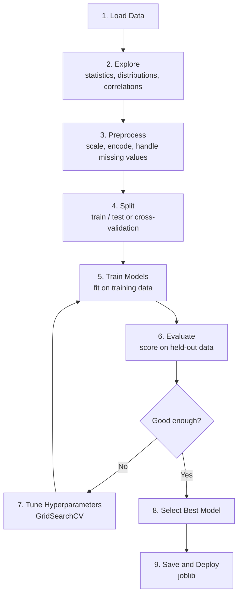

import TawkWidget from '../../../../components/TawkWidget.astro';
import UniversalContentContributors from '../../../../components/UniversalContentContributors.astro';
import InArticleAd from '../../../../components/InArticleAd.astro';
import Copyright from '../../../../components/Copyright.astro';
import BionicText from '../../../../components/BionicText.astro';
import TailwindWrapper from '../../../../components/TailwindWrapper.jsx';
import { Tabs, TabItem } from '@astrojs/starlight/components';
import { Card, CardGrid, Badge, Steps, LinkButton, FileTree } from '@astrojs/starlight/components';

<UniversalContentContributors 
  contributors={frontmatter.contributors}
/>


import MlAiFundamentalsComments from '../../../../components/ml-ai-fundamentals/MlAiFundamentalsComments.astro';

Every ML project follows the same workflow: load data, explore, preprocess, train, evaluate, tune, deploy. Scikit-Learn provides a clean API that standardizes each step. In this lesson you will build a complete, reusable pipeline and compare five algorithms on the same dataset, giving you a template you can apply to any regression or classification problem. #ScikitLearn #MLPipeline #CrossValidation

## The ML Workflow

Every project follows these steps, regardless of the problem domain.



<Card title="Why Pipelines?" icon="star">
Without pipelines, preprocessing and model training are separate steps. This creates a subtle bug: if you fit the scaler on the full dataset before splitting, information from the test set leaks into training. Scikit-Learn Pipelines chain preprocessing and modeling into a single object, ensuring that scaling is fit only on training data during each cross-validation fold.
</Card>

## Generate a Realistic Dataset

<InArticleAd />


We will predict power consumption in a building from sensor readings. This simulates the kind of tabular regression problem you encounter in building automation, industrial IoT, and energy management.

```python
import numpy as np
import pandas as pd

np.random.seed(42)

n_samples = 1000

# Features: building sensor readings
hour = np.random.randint(0, 24, n_samples)
day_of_week = np.random.randint(0, 7, n_samples)
temperature_c = np.random.normal(22, 8, n_samples)
humidity_pct = np.random.normal(50, 15, n_samples).clip(10, 95)
occupancy = np.random.poisson(lam=30, size=n_samples).clip(0, 120)
light_level_lux = np.random.normal(400, 150, n_samples).clip(0, 1000)
hvac_setpoint_c = np.random.normal(22, 2, n_samples)
wind_speed_ms = np.random.exponential(3, n_samples).clip(0, 20)

# Target: power consumption (kWh) with realistic relationships
power_kwh = (
    50                                          # base load
    + 2.5 * occupancy                           # more people, more power
    + 3.0 * np.abs(temperature_c - hvac_setpoint_c)  # HVAC effort
    + 0.5 * humidity_pct                        # dehumidification
    + 0.02 * light_level_lux                    # lighting
    + 15 * np.sin(2 * np.pi * hour / 24)        # daily cycle
    + np.where(day_of_week < 5, 20, -10)         # weekday vs weekend
    + np.random.normal(0, 10, n_samples)        # noise
)

data = pd.DataFrame({
    'hour': hour,
    'day_of_week': day_of_week,
    'temperature_c': np.round(temperature_c, 1),
    'humidity_pct': np.round(humidity_pct, 1),
    'occupancy': occupancy,
    'light_level_lux': np.round(light_level_lux, 1),
    'hvac_setpoint_c': np.round(hvac_setpoint_c, 1),
    'wind_speed_ms': np.round(wind_speed_ms, 1),
    'power_kwh': np.round(power_kwh, 1)
})

print("Dataset shape:", data.shape)
print("\nFirst 5 rows:")
print(data.head().to_string())
print("\nSummary statistics:")
print(data.describe().round(2).to_string())
print("\nCorrelation with power_kwh:")
correlations = data.corr()['power_kwh'].drop('power_kwh').sort_values(ascending=False)
print(correlations.round(3).to_string())
```

**Expected output (first few rows will vary, statistics approximate):**

```text
Dataset shape: (1000, 9)

First 5 rows:
   hour  day_of_week  temperature_c  humidity_pct  occupancy  ...
0    14            4           26.0          52.3         33  ...

Summary statistics:
       hour  day_of_week  temperature_c  ...    power_kwh
count  1000         1000           1000  ...       1000.0
mean   11.6          3.0           22.1  ...        163.5
std     6.9          2.0            7.9  ...         42.8
...

Correlation with power_kwh:
occupancy          0.481
humidity_pct       0.182
temperature_c      0.086
...
```

Occupancy has the strongest correlation with power consumption, which matches our synthetic formula. But correlations only capture linear relationships. The HVAC effort term (absolute difference between temperature and setpoint) is nonlinear and will not show up well in simple correlation.

## Data Preprocessing with Pipelines

<InArticleAd />


```python
import numpy as np
import pandas as pd
from sklearn.model_selection import train_test_split
from sklearn.preprocessing import StandardScaler, PolynomialFeatures
from sklearn.pipeline import Pipeline

np.random.seed(42)

# (Regenerate the dataset from above, or assume 'data' is already loaded)
# For a self-contained script, we regenerate:
n_samples = 1000
hour = np.random.randint(0, 24, n_samples)
day_of_week = np.random.randint(0, 7, n_samples)
temperature_c = np.random.normal(22, 8, n_samples)
humidity_pct = np.random.normal(50, 15, n_samples).clip(10, 95)
occupancy = np.random.poisson(lam=30, size=n_samples).clip(0, 120)
light_level_lux = np.random.normal(400, 150, n_samples).clip(0, 1000)
hvac_setpoint_c = np.random.normal(22, 2, n_samples)
wind_speed_ms = np.random.exponential(3, n_samples).clip(0, 20)

power_kwh = (
    50 + 2.5 * occupancy
    + 3.0 * np.abs(temperature_c - hvac_setpoint_c)
    + 0.5 * humidity_pct + 0.02 * light_level_lux
    + 15 * np.sin(2 * np.pi * hour / 24)
    + np.where(day_of_week < 5, 20, -10)
    + np.random.normal(0, 10, n_samples)
)

data = pd.DataFrame({
    'hour': hour, 'day_of_week': day_of_week,
    'temperature_c': np.round(temperature_c, 1),
    'humidity_pct': np.round(humidity_pct, 1),
    'occupancy': occupancy,
    'light_level_lux': np.round(light_level_lux, 1),
    'hvac_setpoint_c': np.round(hvac_setpoint_c, 1),
    'wind_speed_ms': np.round(wind_speed_ms, 1),
    'power_kwh': np.round(power_kwh, 1)
})

X = data.drop('power_kwh', axis=1)
y = data['power_kwh']

X_train, X_test, y_train, y_test = train_test_split(
    X, y, test_size=0.2, random_state=42
)

print(f"Training set: {X_train.shape[0]} samples")
print(f"Test set:     {X_test.shape[0]} samples")

# Build a pipeline: scale, then add polynomial features
preprocessing_pipe = Pipeline([
    ('scaler', StandardScaler()),
    ('poly', PolynomialFeatures(degree=2, include_bias=False)),
])

# Fit only on training data (no data leakage)
X_train_processed = preprocessing_pipe.fit_transform(X_train)
X_test_processed = preprocessing_pipe.transform(X_test)

print(f"\nOriginal features: {X_train.shape[1]}")
print(f"After polynomial expansion: {X_train_processed.shape[1]}")
```

**Expected output:**

```text
Training set: 800 samples
Test set:     200 samples

Original features: 8
After polynomial expansion: 44
```

The pipeline ensures that `StandardScaler` is fit on training data only. When we call `transform` on the test set, it uses the training mean and standard deviation. Polynomial features create interaction terms (temperature * humidity, hour * occupancy, etc.) that can capture nonlinear relationships.

## Cross-Validation and Model Comparison

<InArticleAd />


A single train/test split can give misleading results. Cross-validation runs k different splits and averages the scores, giving a more reliable estimate.

```python
import numpy as np
import pandas as pd
from sklearn.model_selection import train_test_split, cross_val_score
from sklearn.preprocessing import StandardScaler
from sklearn.pipeline import Pipeline
from sklearn.linear_model import LinearRegression, Ridge, Lasso
from sklearn.ensemble import RandomForestRegressor, GradientBoostingRegressor

np.random.seed(42)

# Regenerate dataset
n_samples = 1000
hour = np.random.randint(0, 24, n_samples)
day_of_week = np.random.randint(0, 7, n_samples)
temperature_c = np.random.normal(22, 8, n_samples)
humidity_pct = np.random.normal(50, 15, n_samples).clip(10, 95)
occupancy = np.random.poisson(lam=30, size=n_samples).clip(0, 120)
light_level_lux = np.random.normal(400, 150, n_samples).clip(0, 1000)
hvac_setpoint_c = np.random.normal(22, 2, n_samples)
wind_speed_ms = np.random.exponential(3, n_samples).clip(0, 20)

power_kwh = (
    50 + 2.5 * occupancy
    + 3.0 * np.abs(temperature_c - hvac_setpoint_c)
    + 0.5 * humidity_pct + 0.02 * light_level_lux
    + 15 * np.sin(2 * np.pi * hour / 24)
    + np.where(day_of_week < 5, 20, -10)
    + np.random.normal(0, 10, n_samples)
)

data = pd.DataFrame({
    'hour': hour, 'day_of_week': day_of_week,
    'temperature_c': np.round(temperature_c, 1),
    'humidity_pct': np.round(humidity_pct, 1),
    'occupancy': occupancy,
    'light_level_lux': np.round(light_level_lux, 1),
    'hvac_setpoint_c': np.round(hvac_setpoint_c, 1),
    'wind_speed_ms': np.round(wind_speed_ms, 1),
    'power_kwh': np.round(power_kwh, 1)
})

X = data.drop('power_kwh', axis=1)
y = data['power_kwh']

# Define models inside pipelines (each has its own scaler)
models = {
    'Linear Regression': Pipeline([
        ('scaler', StandardScaler()),
        ('model', LinearRegression()),
    ]),
    'Ridge (alpha=1.0)': Pipeline([
        ('scaler', StandardScaler()),
        ('model', Ridge(alpha=1.0)),
    ]),
    'Lasso (alpha=1.0)': Pipeline([
        ('scaler', StandardScaler()),
        ('model', Lasso(alpha=1.0)),
    ]),
    'Random Forest': Pipeline([
        ('scaler', StandardScaler()),
        ('model', RandomForestRegressor(
            n_estimators=100, max_depth=10, random_state=42
        )),
    ]),
    'Gradient Boosting': Pipeline([
        ('scaler', StandardScaler()),
        ('model', GradientBoostingRegressor(
            n_estimators=100, max_depth=5, random_state=42
        )),
    ]),
}

print("5-Fold Cross-Validation Results (R-squared)")
print("=" * 55)

results = {}
for name, pipeline in models.items():
    scores = cross_val_score(pipeline, X, y, cv=5, scoring='r2')
    results[name] = scores
    print(f"{name:25s} | Mean R2: {scores.mean():.4f} "
          f"(+/- {scores.std():.4f})")

print("\nBest model:", max(results, key=lambda k: results[k].mean()))
```

**Expected output (approximate):**

```text
5-Fold Cross-Validation Results (R-squared)
=======================================================
Linear Regression         | Mean R2: 0.8431 (+/- 0.0112)
Ridge (alpha=1.0)         | Mean R2: 0.8432 (+/- 0.0111)
Lasso (alpha=1.0)         | Mean R2: 0.8387 (+/- 0.0118)
Random Forest             | Mean R2: 0.9204 (+/- 0.0087)
Gradient Boosting         | Mean R2: 0.9312 (+/- 0.0065)

Best model: Gradient Boosting
```

```text
  Cross-Validation (5-fold)
  ──────────────────────────────────────────
  Full Dataset
  ┌──────┬──────┬──────┬──────┬──────┐
  │Fold 1│Fold 2│Fold 3│Fold 4│Fold 5│
  └──────┴──────┴──────┴──────┴──────┘

  Iteration 1:  TEST  Train  Train  Train  Train  -> score1
  Iteration 2:  Train  TEST  Train  Train  Train  -> score2
  Iteration 3:  Train  Train  TEST  Train  Train  -> score3
  Iteration 4:  Train  Train  Train  TEST  Train  -> score4
  Iteration 5:  Train  Train  Train  Train  TEST  -> score5

  Final score = mean(score1..score5)
  Each sample appears in the test set exactly once.
```

Gradient Boosting wins because it can model nonlinear relationships (like the HVAC effort term) that linear models miss.

## Hyperparameter Tuning with GridSearchCV

<InArticleAd />


```python
import numpy as np
import pandas as pd
from sklearn.model_selection import train_test_split, GridSearchCV
from sklearn.preprocessing import StandardScaler
from sklearn.pipeline import Pipeline
from sklearn.ensemble import GradientBoostingRegressor

np.random.seed(42)

# Regenerate dataset (same as above)
n_samples = 1000
hour = np.random.randint(0, 24, n_samples)
day_of_week = np.random.randint(0, 7, n_samples)
temperature_c = np.random.normal(22, 8, n_samples)
humidity_pct = np.random.normal(50, 15, n_samples).clip(10, 95)
occupancy = np.random.poisson(lam=30, size=n_samples).clip(0, 120)
light_level_lux = np.random.normal(400, 150, n_samples).clip(0, 1000)
hvac_setpoint_c = np.random.normal(22, 2, n_samples)
wind_speed_ms = np.random.exponential(3, n_samples).clip(0, 20)

power_kwh = (
    50 + 2.5 * occupancy
    + 3.0 * np.abs(temperature_c - hvac_setpoint_c)
    + 0.5 * humidity_pct + 0.02 * light_level_lux
    + 15 * np.sin(2 * np.pi * hour / 24)
    + np.where(day_of_week < 5, 20, -10)
    + np.random.normal(0, 10, n_samples)
)

data = pd.DataFrame({
    'hour': hour, 'day_of_week': day_of_week,
    'temperature_c': np.round(temperature_c, 1),
    'humidity_pct': np.round(humidity_pct, 1),
    'occupancy': occupancy,
    'light_level_lux': np.round(light_level_lux, 1),
    'hvac_setpoint_c': np.round(hvac_setpoint_c, 1),
    'wind_speed_ms': np.round(wind_speed_ms, 1),
    'power_kwh': np.round(power_kwh, 1)
})

X = data.drop('power_kwh', axis=1)
y = data['power_kwh']
X_train, X_test, y_train, y_test = train_test_split(
    X, y, test_size=0.2, random_state=42
)

# Pipeline with tunable parameters
pipe = Pipeline([
    ('scaler', StandardScaler()),
    ('model', GradientBoostingRegressor(random_state=42)),
])

# Parameter grid (prefix parameter names with step name + __)
param_grid = {
    'model__n_estimators': [50, 100, 200],
    'model__max_depth': [3, 5, 7],
    'model__learning_rate': [0.05, 0.1, 0.2],
}

# GridSearchCV tries all combinations (3 x 3 x 3 = 27 fits x 5 folds = 135 fits)
grid_search = GridSearchCV(
    pipe, param_grid, cv=5, scoring='r2',
    n_jobs=-1, verbose=0
)

print("Running GridSearchCV (27 combinations x 5 folds = 135 fits)...")
grid_search.fit(X_train, y_train)

print(f"\nBest parameters: {grid_search.best_params_}")
print(f"Best CV R2 score: {grid_search.best_score_:.4f}")

# Evaluate on held-out test set
test_score = grid_search.score(X_test, y_test)
print(f"Test R2 score:    {test_score:.4f}")

# Show top 5 parameter combinations
results_df = pd.DataFrame(grid_search.cv_results_)
top5 = results_df.nsmallest(5, 'rank_test_score')[
    ['param_model__n_estimators', 'param_model__max_depth',
     'param_model__learning_rate', 'mean_test_score', 'std_test_score']
]
print("\nTop 5 parameter combinations:")
print(top5.to_string(index=False))
```

**Expected output (approximate):**

```text
Running GridSearchCV (27 combinations x 5 folds = 135 fits)...

Best parameters: {'model__learning_rate': 0.1, 'model__max_depth': 5, 'model__n_estimators': 200}
Best CV R2 score: 0.9345
Test R2 score:    0.9401

Top 5 parameter combinations:
 param_model__n_estimators param_model__max_depth  ...  mean_test_score  std_test_score
                       200                      5  ...           0.9345          0.0058
                       100                      5  ...           0.9312          0.0065
                       200                      7  ...           0.9298          0.0071
                       ...
```

## Model Persistence

<InArticleAd />


Save the trained model and load it later for inference. This is how you go from training to deployment.

```python
import numpy as np
import pandas as pd
import joblib
from sklearn.model_selection import train_test_split
from sklearn.preprocessing import StandardScaler
from sklearn.pipeline import Pipeline
from sklearn.ensemble import GradientBoostingRegressor

np.random.seed(42)

# Regenerate and train (abbreviated)
n_samples = 1000
hour = np.random.randint(0, 24, n_samples)
day_of_week = np.random.randint(0, 7, n_samples)
temperature_c = np.random.normal(22, 8, n_samples)
humidity_pct = np.random.normal(50, 15, n_samples).clip(10, 95)
occupancy = np.random.poisson(lam=30, size=n_samples).clip(0, 120)
light_level_lux = np.random.normal(400, 150, n_samples).clip(0, 1000)
hvac_setpoint_c = np.random.normal(22, 2, n_samples)
wind_speed_ms = np.random.exponential(3, n_samples).clip(0, 20)

power_kwh = (
    50 + 2.5 * occupancy
    + 3.0 * np.abs(temperature_c - hvac_setpoint_c)
    + 0.5 * humidity_pct + 0.02 * light_level_lux
    + 15 * np.sin(2 * np.pi * hour / 24)
    + np.where(day_of_week < 5, 20, -10)
    + np.random.normal(0, 10, n_samples)
)

data = pd.DataFrame({
    'hour': hour, 'day_of_week': day_of_week,
    'temperature_c': np.round(temperature_c, 1),
    'humidity_pct': np.round(humidity_pct, 1),
    'occupancy': occupancy,
    'light_level_lux': np.round(light_level_lux, 1),
    'hvac_setpoint_c': np.round(hvac_setpoint_c, 1),
    'wind_speed_ms': np.round(wind_speed_ms, 1),
    'power_kwh': np.round(power_kwh, 1)
})

X = data.drop('power_kwh', axis=1)
y = data['power_kwh']

pipe = Pipeline([
    ('scaler', StandardScaler()),
    ('model', GradientBoostingRegressor(
        n_estimators=200, max_depth=5, learning_rate=0.1, random_state=42
    )),
])
pipe.fit(X, y)

# Save the entire pipeline (scaler + model)
joblib.dump(pipe, 'power_model.joblib')
print("Model saved to power_model.joblib")

# Load and predict
loaded_pipe = joblib.load('power_model.joblib')

# New building sensor readings
new_data = pd.DataFrame({
    'hour': [14],
    'day_of_week': [2],       # Wednesday
    'temperature_c': [28.5],
    'humidity_pct': [55.0],
    'occupancy': [45],
    'light_level_lux': [500.0],
    'hvac_setpoint_c': [22.0],
    'wind_speed_ms': [3.2],
})

prediction = loaded_pipe.predict(new_data)
print(f"\nPredicted power consumption: {prediction[0]:.1f} kWh")
print("(Wednesday afternoon, 45 occupants, 28.5C with 22C setpoint)")
```

**Expected output:**

```text
Model saved to power_model.joblib

Predicted power consumption: 193.4 kWh
(Wednesday afternoon, 45 occupants, 28.5C with 22C setpoint)
```

The saved `.joblib` file contains both the scaler and the model. When you load it, preprocessing and prediction happen in one `predict()` call. No separate scaling step, no chance of using the wrong scaler.

## The Reusable ML Template

<InArticleAd />


Every project you build from now on can follow this pattern.

<Steps>

1. **Load and explore** your data with pandas. Check shapes, types, distributions, and correlations.

2. **Build a Pipeline** that chains preprocessing (scaling, encoding, feature engineering) with a model. This prevents data leakage.

3. **Cross-validate** with `cross_val_score` to get reliable performance estimates across multiple splits.

4. **Compare models** by running several algorithms through the same pipeline and comparing cross-validation scores.

5. **Tune** the best model's hyperparameters with `GridSearchCV` (exhaustive) or `RandomizedSearchCV` (faster for large search spaces).

6. **Evaluate** on a held-out test set that was never used during training or tuning.

7. **Save** with `joblib.dump()` and load with `joblib.load()` for deployment.

</Steps>

This workflow applies whether you are predicting power consumption, classifying sensor anomalies, or estimating remaining useful life of equipment.

<MlAiFundamentalsComments />


<InArticleAd />
<TawkWidget />
<Copyright />