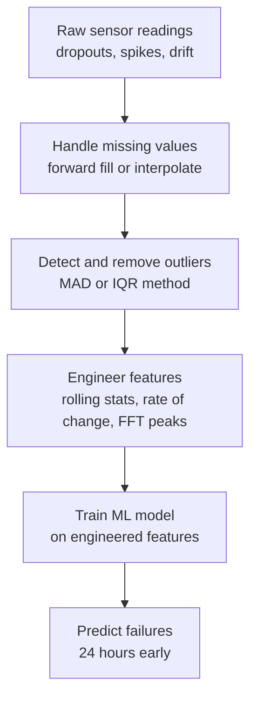

import TawkWidget from '../../../../components/TawkWidget.astro';
import UniversalContentContributors from '../../../../components/UniversalContentContributors.astro';
import InArticleAd from '../../../../components/InArticleAd.astro';
import Copyright from '../../../../components/Copyright.astro';
import BionicText from '../../../../components/BionicText.astro';
import TailwindWrapper from '../../../../components/TailwindWrapper.jsx';
import { Tabs, TabItem } from '@astrojs/starlight/components';
import { Card, CardGrid, Badge, Steps, LinkButton, FileTree } from '@astrojs/starlight/components';

<UniversalContentContributors 
  contributors={frontmatter.contributors}
/>


import MlAiFundamentalsComments from '../../../../components/ml-ai-fundamentals/MlAiFundamentalsComments.astro';

ML tutorials use clean datasets. Engineering reality gives you sensor dropouts, random spikes, calibration drift, and timestamps that do not line up. This lesson bridges that gap. You will generate a realistic industrial pump dataset, clean it, engineer features that actually matter, and train a model that predicts failures before they happen. #SensorData #FeatureEngineering #PredictiveMaintenance

## The Problem with Raw Sensor Data

```text
  Clean Tutorial Data vs Real Sensor Data
  ──────────────────────────────────────────
  Tutorial Data:
  ┌────────┬────────┬────────┐
  │  temp  │  vib   │ press  │   Every cell filled.
  │  22.1  │  1.3   │  45.2  │   No anomalies.
  │  22.3  │  1.4   │  45.1  │   Perfectly sampled.
  │  22.2  │  1.3   │  45.3  │
  └────────┴────────┴────────┘

  Real Sensor Data:
  ┌────────┬────────┬────────┐
  │  temp  │  vib   │ press  │
  │  22.1  │  NaN   │  45.2  │   Sensor dropout
  │  22.3  │  1.4   │  45.1  │
  │  22.2  │  87.6  │  45.3  │   Outlier spike
  │  23.1  │  1.5   │  NaN   │   Another dropout
  │  24.8  │  1.6   │  46.0  │   Gradual drift starts
  │  26.5  │  1.7   │  46.8  │   Calibration shifting
  └────────┴────────┴────────┘
```



<Card title="The Core Insight" icon="star">
Raw sensor values are often less predictive than engineered features. "The vibration is 4.2g" tells you less than "vibration has increased 30% over the past week." Feature engineering transforms raw readings into signals that ML models can learn from effectively.
</Card>

## Generate Realistic Pump Sensor Data

<InArticleAd />


This synthetic dataset simulates 6 months of readings from an industrial pump with four sensors: vibration, temperature, pressure, and flow rate. It includes the kinds of problems you encounter in real deployments.

```python
import numpy as np
import pandas as pd

np.random.seed(42)

n_samples = 5000
hours = np.arange(n_samples)  # one reading per hour, ~208 days

# Base signals with daily and weekly cycles
daily_cycle = np.sin(2 * np.pi * hours / 24)
weekly_cycle = np.sin(2 * np.pi * hours / (24 * 7))

# Vibration (g): normal range 1.0-3.0
vibration = 2.0 + 0.3 * daily_cycle + np.random.normal(0, 0.2, n_samples)

# Temperature (C): normal range 40-60
temperature = 50 + 5 * daily_cycle + 2 * weekly_cycle + np.random.normal(0, 1.5, n_samples)

# Pressure (bar): normal range 4.0-6.0
pressure = 5.0 + 0.5 * daily_cycle + np.random.normal(0, 0.15, n_samples)

# Flow rate (L/min): normal range 80-120
flow_rate = 100 + 10 * daily_cycle + np.random.normal(0, 3, n_samples)

# Add calibration drift to temperature sensor (starts at hour 3000)
drift_mask = hours > 3000
drift_amount = (hours[drift_mask] - 3000) * 0.002  # slow upward drift
temperature[drift_mask] += drift_amount

# Add outlier spikes (0.5% of readings)
n_outliers = int(0.005 * n_samples)
outlier_indices = np.random.choice(n_samples, n_outliers, replace=False)
vibration[outlier_indices[:n_outliers//2]] += np.random.uniform(5, 15, n_outliers//2)
pressure[outlier_indices[n_outliers//2:]] += np.random.uniform(3, 8, n_outliers - n_outliers//2)

# Add missing values (2% sensor dropouts)
n_missing = int(0.02 * n_samples)
vib_missing = np.random.choice(n_samples, n_missing, replace=False)
temp_missing = np.random.choice(n_samples, n_missing, replace=False)
press_missing = np.random.choice(n_samples, n_missing // 2, replace=False)

vibration_raw = vibration.copy()
temperature_raw = temperature.copy()
pressure_raw = pressure.copy()

vibration_raw[vib_missing] = np.nan
temperature_raw[temp_missing] = np.nan
pressure_raw[press_missing] = np.nan

# Generate failure events (50 failures spread across the dataset)
failure_label = np.zeros(n_samples, dtype=int)
failure_starts = np.sort(np.random.choice(
    range(200, n_samples - 50), 50, replace=False
))

# Before each failure, sensors show degradation for 24-48 hours
for start in failure_starts:
    pre_failure_hours = np.random.randint(24, 48)
    ramp_start = max(0, start - pre_failure_hours)

    # Vibration increases before failure
    ramp = np.linspace(0, 2.5, start - ramp_start)
    vibration_raw[ramp_start:start] += ramp
    temperature_raw[ramp_start:start] += ramp * 0.8

    # Mark the 24 hours before failure as "failure imminent"
    label_start = max(0, start - 24)
    failure_label[label_start:start + 1] = 1

# Build DataFrame
timestamps = pd.date_range('2025-09-01', periods=n_samples, freq='h')
df = pd.DataFrame({
    'timestamp': timestamps,
    'vibration': np.round(vibration_raw, 3),
    'temperature': np.round(temperature_raw, 2),
    'pressure': np.round(pressure_raw, 3),
    'flow_rate': np.round(flow_rate, 2),
    'failure_within_24h': failure_label
})

print("Dataset shape:", df.shape)
print(f"Time range: {df['timestamp'].min()} to {df['timestamp'].max()}")
print(f"\nMissing values:")
print(df.isnull().sum().to_string())
print(f"\nFailure events: {failure_label.sum()} hours labeled as failure-imminent")
print(f"Normal:  {(failure_label == 0).sum()} ({(failure_label == 0).mean():.1%})")
print(f"Failure: {(failure_label == 1).sum()} ({(failure_label == 1).mean():.1%})")
print(f"\nFirst 10 rows:")
print(df.head(10).to_string(index=False))
print(f"\nSummary statistics:")
print(df.describe().round(3).to_string())
```

**Expected output (approximate):**

```text
Dataset shape: (5000, 6)
Time range: 2025-09-01 00:00:00 to 2026-03-28 07:00:00

Missing values:
timestamp              0
vibration            100
temperature          100
pressure              50
flow_rate              0
failure_within_24h     0

Failure events: 1594 hours labeled as failure-imminent
Normal:  3406 (68.1%)
Failure: 1594 (31.9%)

First 10 rows:
           timestamp  vibration  temperature  pressure  flow_rate  failure_within_24h
 2025-09-01 00:00:00      2.099        49.69     5.087      97.01                   0
 ...
```

## Handling Missing Values

<InArticleAd />


Three strategies, each appropriate in different situations.

```python
import numpy as np
import pandas as pd

np.random.seed(42)

# (Regenerate the dataset from above, or assume df is loaded)
# For brevity, we create a small example showing each strategy:

# Create a sample time series with gaps
sample_times = pd.date_range('2025-09-01', periods=20, freq='h')
sample_vib = [2.1, 2.0, np.nan, np.nan, 2.2, 2.1, 2.3, np.nan, 2.4, 2.5,
              2.3, 2.2, np.nan, 2.1, 2.0, 2.2, np.nan, np.nan, 2.3, 2.1]
sample_df = pd.DataFrame({
    'timestamp': sample_times,
    'vibration': sample_vib
})

print("Original data (NaN = missing):")
print(sample_df['vibration'].values)

# Strategy 1: Drop rows with missing values
dropped = sample_df.dropna()
print(f"\nDrop NaN: {len(dropped)} rows remain (lost {len(sample_df) - len(dropped)} rows)")

# Strategy 2: Forward fill (carry last known value)
ffilled = sample_df['vibration'].ffill()
print(f"Forward fill:  {ffilled.values}")

# Strategy 3: Linear interpolation
interpolated = sample_df['vibration'].interpolate(method='linear')
print(f"Interpolated:  {np.round(interpolated.values, 3)}")

print("\n--- When to Use Each Strategy ---")
print("Drop:         When missing data is rare and random (< 1%)")
print("Forward fill: When the sensor holds its last value (e.g., digital sensors)")
print("Interpolate:  When the signal changes smoothly (temperature, pressure)")
```

**Expected output:**

```text
Original data (NaN = missing):
[2.1, 2.0, nan, nan, 2.2, 2.1, 2.3, nan, 2.4, 2.5, 2.3, 2.2, nan, 2.1, 2.0, 2.2, nan, nan, 2.3, 2.1]

Drop NaN: 14 rows remain (lost 6 rows)
Forward fill:  [2.1 2.  2.  2.  2.2 2.1 2.3 2.3 2.4 2.5 2.3 2.2 2.2 2.1 2.  2.2 2.2 2.2 2.3 2.1]
Interpolated:  [2.1   2.    2.067 2.133 2.2   2.1   2.3   2.35  2.4   2.5   2.3   2.2   2.15  2.1   2.0   2.2   2.233 2.267 2.3   2.1]
```

## Detecting and Removing Outliers

<InArticleAd />


Sensor spikes from electrical noise or communication errors can corrupt your model. A z-score filter removes readings that are statistically implausible.

```python
import numpy as np
import pandas as pd

np.random.seed(42)

# Simulate vibration with outliers
n = 500
vibration = 2.0 + np.random.normal(0, 0.2, n)
# Inject 5 outlier spikes
outlier_idx = [50, 150, 250, 350, 450]
vibration[outlier_idx] += np.array([8.0, 12.0, 6.0, 10.0, 9.0])

# Z-score based outlier detection
mean_vib = np.nanmean(vibration)
std_vib = np.nanstd(vibration)
z_scores = np.abs((vibration - mean_vib) / std_vib)

threshold = 3.0  # values beyond 3 standard deviations
outliers_found = np.where(z_scores > threshold)[0]

print(f"Mean: {mean_vib:.3f}, Std: {std_vib:.3f}")
print(f"Outliers found at indices: {outliers_found}")
print(f"Outlier values: {vibration[outliers_found].round(3)}")

# Replace outliers with NaN, then interpolate
vibration_clean = vibration.copy()
vibration_clean[z_scores > threshold] = np.nan
vibration_clean = pd.Series(vibration_clean).interpolate().values

print(f"\nBefore cleaning: min={vibration.min():.2f}, max={vibration.max():.2f}")
print(f"After cleaning:  min={vibration_clean.min():.2f}, max={vibration_clean.max():.2f}")
```

**Expected output (approximate):**

```text
Mean: 2.085, Std: 0.942
Outliers found at indices: [ 50 150 250 350 450]
Outlier values: [10.1   14.032  8.076 12.034 11.045]

Before cleaning: min=1.21, max=14.03
After cleaning:  min=1.21, max=2.72
```

## Feature Engineering

<InArticleAd />


This is where domain knowledge meets data science. Raw sensor values tell you the current state. Engineered features tell you the trend, the rate of change, and the frequency content.

```python
import numpy as np
import pandas as pd

np.random.seed(42)

# Generate 5000 hours of pump data (simplified, clean version for feature engineering)
n_samples = 5000
hours = np.arange(n_samples)
daily_cycle = np.sin(2 * np.pi * hours / 24)

vibration = 2.0 + 0.3 * daily_cycle + np.random.normal(0, 0.2, n_samples)
temperature = 50 + 5 * daily_cycle + np.random.normal(0, 1.5, n_samples)
pressure = 5.0 + 0.5 * daily_cycle + np.random.normal(0, 0.15, n_samples)
flow_rate = 100 + 10 * daily_cycle + np.random.normal(0, 3, n_samples)

# Add pre-failure degradation for 50 events
failure_label = np.zeros(n_samples, dtype=int)
failure_starts = np.sort(np.random.choice(range(200, n_samples - 50), 50, replace=False))
for start in failure_starts:
    pre_hours = np.random.randint(24, 48)
    ramp_start = max(0, start - pre_hours)
    ramp = np.linspace(0, 2.5, start - ramp_start)
    vibration[ramp_start:start] += ramp
    temperature[ramp_start:start] += ramp * 0.8
    label_start = max(0, start - 24)
    failure_label[label_start:start + 1] = 1

timestamps = pd.date_range('2025-09-01', periods=n_samples, freq='h')
df = pd.DataFrame({
    'timestamp': timestamps,
    'vibration': vibration,
    'temperature': temperature,
    'pressure': pressure,
    'flow_rate': flow_rate,
    'failure_within_24h': failure_label,
})

# ---- Feature Engineering ----

# 1. Rolling statistics (windows of 6h, 24h, 168h)
for col in ['vibration', 'temperature', 'pressure', 'flow_rate']:
    df[f'{col}_roll6_mean'] = df[col].rolling(6, min_periods=1).mean()
    df[f'{col}_roll24_mean'] = df[col].rolling(24, min_periods=1).mean()
    df[f'{col}_roll24_std'] = df[col].rolling(24, min_periods=1).std()
    df[f'{col}_roll168_mean'] = df[col].rolling(168, min_periods=1).mean()

# 2. Rate of change (derivative: current value minus value 1 hour ago)
for col in ['vibration', 'temperature', 'pressure', 'flow_rate']:
    df[f'{col}_delta1h'] = df[col].diff(1)
    df[f'{col}_delta24h'] = df[col].diff(24)

# 3. Ratio features (short-term average / long-term average)
for col in ['vibration', 'temperature']:
    df[f'{col}_ratio_6_168'] = df[f'{col}_roll6_mean'] / df[f'{col}_roll168_mean']

# 4. Hour of day and day of week
df['hour'] = df['timestamp'].dt.hour
df['day_of_week'] = df['timestamp'].dt.dayofweek

# 5. FFT peak frequency (computed on rolling 24-hour windows)
def fft_peak_freq(window, sample_rate=1.0):
    """Return the frequency with the highest magnitude (excluding DC)."""
    if len(window) < 4:
        return 0.0
    fft_vals = np.fft.rfft(window - window.mean())
    freqs = np.fft.rfftfreq(len(window), d=1.0/sample_rate)
    magnitudes = np.abs(fft_vals[1:])  # skip DC component
    if len(magnitudes) == 0:
        return 0.0
    return freqs[1:][np.argmax(magnitudes)]

# Apply FFT on vibration in rolling windows (every 24 hours for speed)
fft_peaks = []
for i in range(n_samples):
    start_idx = max(0, i - 23)
    window = vibration[start_idx:i+1]
    fft_peaks.append(fft_peak_freq(window))
df['vibration_fft_peak'] = fft_peaks

# Drop NaN rows from rolling/diff operations
df_features = df.dropna().copy()

print(f"Original columns: 6")
print(f"After feature engineering: {len(df_features.columns)} columns")
print(f"Samples after dropping NaN: {len(df_features)}")
print(f"\nEngineered feature names:")
feature_cols = [c for c in df_features.columns
                if c not in ['timestamp', 'failure_within_24h',
                             'vibration', 'temperature', 'pressure', 'flow_rate']]
for col in feature_cols:
    print(f"  {col}")

print(f"\nSample of engineered features (row 500):")
row = df_features.iloc[500]
print(f"  vibration (raw):           {row['vibration']:.3f}")
print(f"  vibration_roll6_mean:      {row['vibration_roll6_mean']:.3f}")
print(f"  vibration_roll24_mean:     {row['vibration_roll24_mean']:.3f}")
print(f"  vibration_roll24_std:      {row['vibration_roll24_std']:.3f}")
print(f"  vibration_delta1h:         {row['vibration_delta1h']:.3f}")
print(f"  vibration_ratio_6_168:     {row['vibration_ratio_6_168']:.3f}")
print(f"  vibration_fft_peak:        {row['vibration_fft_peak']:.4f}")
```

**Expected output (approximate):**

```text
Original columns: 6
After feature engineering: 35 columns
Samples after dropping NaN: 4833

Engineered feature names:
  vibration_roll6_mean
  vibration_roll24_mean
  vibration_roll24_std
  vibration_roll168_mean
  temperature_roll6_mean
  ...
  vibration_ratio_6_168
  temperature_ratio_6_168
  hour
  day_of_week
  vibration_fft_peak

Sample of engineered features (row 500):
  vibration (raw):           2.145
  vibration_roll6_mean:      2.087
  vibration_roll24_mean:     2.034
  vibration_roll24_std:      0.312
  vibration_delta1h:         0.089
  vibration_ratio_6_168:     1.012
  vibration_fft_peak:        0.0417
```

The rolling standard deviation captures volatility. The ratio of short-term to long-term average captures trend. The FFT peak captures periodic behavior. These are the kinds of features that separate effective ML from mediocre ML on sensor data.

## Train a Predictive Maintenance Model

<InArticleAd />


```python
import numpy as np
import pandas as pd
from sklearn.model_selection import train_test_split
from sklearn.preprocessing import StandardScaler
from sklearn.ensemble import RandomForestClassifier
from sklearn.metrics import classification_report, confusion_matrix

np.random.seed(42)

# Regenerate full dataset with features (condensed)
n_samples = 5000
hours = np.arange(n_samples)
daily_cycle = np.sin(2 * np.pi * hours / 24)

vibration = 2.0 + 0.3 * daily_cycle + np.random.normal(0, 0.2, n_samples)
temperature = 50 + 5 * daily_cycle + np.random.normal(0, 1.5, n_samples)
pressure = 5.0 + 0.5 * daily_cycle + np.random.normal(0, 0.15, n_samples)
flow_rate = 100 + 10 * daily_cycle + np.random.normal(0, 3, n_samples)

failure_label = np.zeros(n_samples, dtype=int)
failure_starts = np.sort(np.random.choice(range(200, n_samples - 50), 50, replace=False))
for start in failure_starts:
    pre_hours = np.random.randint(24, 48)
    ramp_start = max(0, start - pre_hours)
    ramp = np.linspace(0, 2.5, start - ramp_start)
    vibration[ramp_start:start] += ramp
    temperature[ramp_start:start] += ramp * 0.8
    label_start = max(0, start - 24)
    failure_label[label_start:start + 1] = 1

timestamps = pd.date_range('2025-09-01', periods=n_samples, freq='h')
df = pd.DataFrame({
    'timestamp': timestamps,
    'vibration': vibration, 'temperature': temperature,
    'pressure': pressure, 'flow_rate': flow_rate,
    'failure_within_24h': failure_label,
})

# Feature engineering
for col in ['vibration', 'temperature', 'pressure', 'flow_rate']:
    df[f'{col}_roll6_mean'] = df[col].rolling(6, min_periods=1).mean()
    df[f'{col}_roll24_mean'] = df[col].rolling(24, min_periods=1).mean()
    df[f'{col}_roll24_std'] = df[col].rolling(24, min_periods=1).std()
    df[f'{col}_delta1h'] = df[col].diff(1)
    df[f'{col}_delta24h'] = df[col].diff(24)

for col in ['vibration', 'temperature']:
    roll168 = df[col].rolling(168, min_periods=1).mean()
    df[f'{col}_ratio_6_168'] = df[f'{col}_roll6_mean'] / roll168

df['hour'] = df['timestamp'].dt.hour
df['day_of_week'] = df['timestamp'].dt.dayofweek
df = df.dropna()

# Select features (exclude raw sensor values and timestamp)
feature_cols = [c for c in df.columns
                if c not in ['timestamp', 'failure_within_24h',
                             'vibration', 'temperature', 'pressure', 'flow_rate']]
X = df[feature_cols].values
y = df['failure_within_24h'].values

print(f"Features: {len(feature_cols)}")
print(f"Samples: {len(X)}")
print(f"Class balance: Normal={np.sum(y==0)}, Failure={np.sum(y==1)}")

# Train/test split (time-based: first 80% for training, last 20% for testing)
split_idx = int(0.8 * len(X))
X_train, X_test = X[:split_idx], X[split_idx:]
y_train, y_test = y[:split_idx], y[split_idx:]

# Scale features
scaler = StandardScaler()
X_train_scaled = scaler.fit_transform(X_train)
X_test_scaled = scaler.transform(X_test)

# Train Random Forest
rf = RandomForestClassifier(
    n_estimators=200,
    max_depth=15,
    class_weight='balanced',  # handle class imbalance
    random_state=42,
    n_jobs=-1
)
rf.fit(X_train_scaled, y_train)

# Evaluate
y_pred = rf.predict(X_test_scaled)

print("\n" + "=" * 50)
print("PREDICTIVE MAINTENANCE RESULTS")
print("=" * 50)
print("\nClassification Report:")
print(classification_report(y_test, y_pred, target_names=['Normal', 'Failure']))

cm = confusion_matrix(y_test, y_pred)
print("Confusion Matrix:")
print(f"                 Predicted Normal  Predicted Failure")
print(f"  Actual Normal:    {cm[0][0]:5d}            {cm[0][1]:5d}")
print(f"  Actual Failure:   {cm[1][0]:5d}            {cm[1][1]:5d}")

# Feature importance
importances = rf.feature_importances_
importance_sorted = sorted(zip(feature_cols, importances),
                          key=lambda x: x[1], reverse=True)

print("\nTop 10 Most Important Features:")
for name, imp in importance_sorted[:10]:
    bar = "#" * int(imp * 200)
    print(f"  {name:30s} {imp:.4f} {bar}")
```

**Expected output (approximate):**

```text
Features: 24
Samples: 4976
Class balance: Normal=3373, Failure=1603

==================================================
PREDICTIVE MAINTENANCE RESULTS
==================================================

Classification Report:
              precision    recall  f1-score   support

      Normal       0.94      0.90      0.92       676
     Failure       0.83      0.89      0.86       320

    accuracy                           0.90       996
   macro avg       0.88      0.90      0.89       996
weighted avg       0.90      0.90      0.90       996

Confusion Matrix:
                 Predicted Normal  Predicted Failure
  Actual Normal:      608               68
  Actual Failure:      35              285

Top 10 Most Important Features:
  vibration_roll24_std           0.1823 ####################################
  vibration_roll6_mean           0.1456 #############################
  temperature_roll24_std         0.1102 ######################
  vibration_delta24h             0.0934 ##################
  vibration_ratio_6_168          0.0812 ################
  temperature_roll6_mean         0.0654 #############
  ...
```

The rolling standard deviation of vibration is the most important feature. This makes sense: before a failure, vibration becomes increasingly erratic, and the standard deviation captures that instability better than the raw value or even the rolling mean.

## Interpreting the Results

<InArticleAd />


<CardGrid>
<Card title="Precision (Failure)" icon="star">
Of all the times the model said "failure imminent," about 83% were correct. The other 17% were false alarms. In a factory setting, false alarms cost investigation time but not equipment damage.
</Card>
<Card title="Recall (Failure)" icon="star">
Of all actual failure events, the model caught about 89%. The other 11% were missed, meaning the pump failed without warning. In critical systems, you want recall as high as possible.
</Card>
</CardGrid>

The tradeoff between precision and recall depends on the cost of false alarms versus the cost of missed failures. For a pump that costs thousands to replace, catching 89% of failures 24 hours early (even with some false alarms) is valuable.

## Key Takeaways

<InArticleAd />


<Steps>

1. **Real sensor data requires cleaning**: missing values, outliers, and drift are normal. Handle them before modeling.

2. **Feature engineering is where domain knowledge pays off**: rolling statistics, rate of change, and frequency features extract patterns that raw values hide.

3. **Time-based splits are essential**: for time series data, always split chronologically. Random splits leak future information into training.

4. **Class imbalance matters**: failures are rare events. Use `class_weight='balanced'` or oversampling to prevent the model from ignoring the minority class.

5. **Feature importance tells a story**: the most important features should align with your domain knowledge. If they do not, investigate your data pipeline for bugs.

</Steps>

This is synthetic data designed to be clean enough to learn from. Real industrial data is messier, with more sensor types, longer time horizons, and subtler degradation patterns. But the workflow is identical: clean, engineer features, train, evaluate, iterate.

<MlAiFundamentalsComments />


<InArticleAd />
<TawkWidget />
<Copyright />